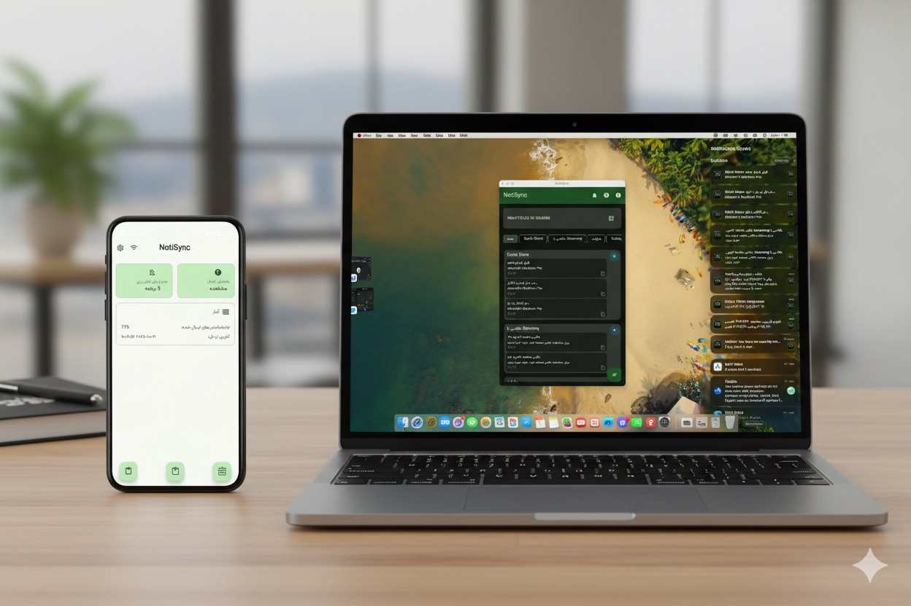

# NotiSync

NotiSync is a Kotlin Multiplatform project that allows you to synchronize notifications and
clipboard content between your Android device and one or more desktop computers.

This project consists of an Android application and a Desktop (JVM) application.

**Download Android App:**

**Download Desktop App:**
[دریافت نسخه لینوکس/ مک / ویندوز](https://tools.esfandune.ir/)

